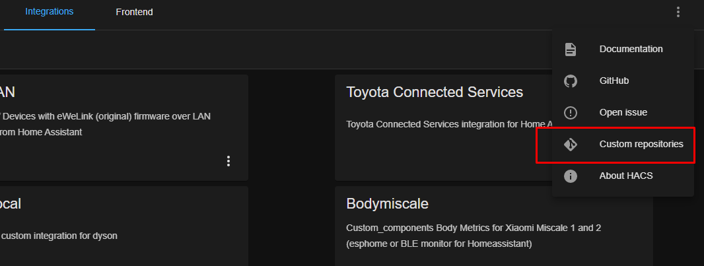
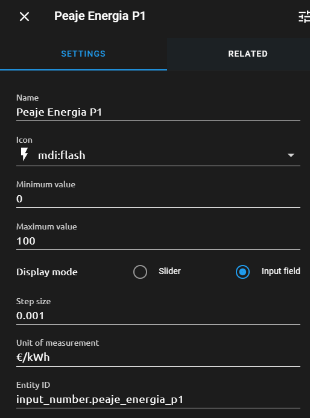
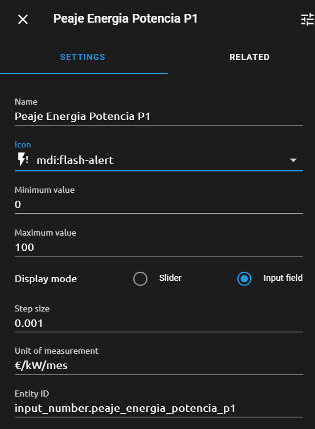

[](https://github.com/custom-components/hacs)


# i-DE (Iberdrola Distribución) API for Home Assistant

i-DE (Iberdrola Distribución) Home Assistant Custom Integration, providing realtime energy meter readings

## Description

Adds integration with i-DE in Home Assistant

This sensor will update every hour.

Important: Keep in mind that each reading is done directly to your home meter, and it takes sometime to return a result. As per i-DE it may take up to 2 minutes to get a reading. This delay will also lead to Home Assistant starting slowly until a response from the meter is obtained.

### Known Issues

- By the moment, this integration is limited to one contract. Should you have more then one contract with i-DE, the integration will obtain the data for the main contract only.
- On HA start/booting, if the sensor fails to obtain a response from the meter, the sensor will fail to be setup and further updates will not be performed. In case this happens, it is recommended to restart HA until everything works well.
- The reading is done directly to your meter. Due to connectivity issues or i-DE server issues, you may not always obtain readings as expected. Keep in mind that sometimes a delay on the reading may occurr.
- The reading only returns integer values. If from the last reading your meter indicates a variance minor then 1 kWh, the integration will not reflect any variance and that will only be recorded once the variance from the previous reading is greater then 1. 

## Getting Started

### Dependencies

You should have an i-DE username and access to the Clients' website. You may register here: [Área Clientes | I-DE - Grupo Iberdrola](https://www.i-de.es/consumidores/web/guest/login).

Make sure to complement all information to have an "Advanced User" profile.

### Installation

#### - Manual method

- Download/clone this repo
- Copy the [custom_components/ide](custom_components/ide) folder into your custom_components folder into your HA installation
- Restart HA

#### - [HACS](https://hacs.xyz/) method (recommended)

- Copy this repo URL
- In the HACS section, add this repo as a custom one:

  
  
  - On the "Repository" field put the URL copied before
  - On the "Category" select "Integration"
  - Click the "Download" button and download latest version. 
- Restart HA

## How to configure

- Edit your `configuration.yaml` (or your `sensor.yaml` without _`sensor:`_) file to add this sensor:

```yaml
sensor:
  - platform: ide
    username: <username>
    password: <password>
    id: <contract id>
```

Use the _\<username\>_ and _\<password\>_ you use on the i-DE webpage. (It is recommended to use the [HA secrets](https://www.home-assistant.io/docs/configuration/secrets/) files for security pourposes)

- Restart HA

## Usage

### Sensors

Utility Meter sensors inside `configuration.yaml`


#### How to configure hourly, daily and monthly costs sensors

- Edit your `configuration.yaml` file to add this sensor:

```yaml
# UTILITY METER #
utility_meter:
  # HOME ENERGY #
  home_energy_hourly:
    source: sensor.ide_meter_reading
    cycle: hourly

  home_energy_daily:
    source: sensor.ide_meter_reading
    cycle: daily

  home_energy_monthly:
    source: sensor.ide_meter_reading
    cycle: monthly

  home_energy_cost_hourly:
    source: sensor.home_energy_cost
    cycle: hourly

  home_energy_cost_daily:
    source: sensor.home_energy_cost
    cycle: daily

  home_energy_cost_monthly:
    source: sensor.home_energy_cost
    cycle: monthly
```

In the `sensor.yaml` file or under sensor in `configuration.yaml`

- With the cost calculations template (inside your `configuration.yaml` file) as:

```yaml
# ENERGY COST #
- platform: template
  sensors:
    home_energy_cost:
      friendly_name: "Home Energy Cost"
      unit_of_measurement: "€"
      value_template: >
         
         
         
        
        {{ (( states('sensor.home_energy_hourly') | float * (peaje + states('sensor.pvpc') | float) ) * states('input_number.impuesto_energia') | float * states('input_number.iva_energia') | float) | round(3) }}
```

To complement the cost calculation, I consider the costs of Toll, Energy Tax and VAT. For that create some "helpers" with input_number.

* input_number.impuesto_energia (%) >> 1.051127
* input_number.iva_energia (%) >> 1.10
* input_number.peaje_energia_p1 (this what you have in the invoice)
* input_number.peaje_energia_p2 (this what you have in the invoice)
* input_number.peaje_energia_p3 (this what you have in the invoice)
* input_number.peaje_energia_potencia_p1 (this what you have in the invoice)
* input_number.peaje_energia_potencia_p2 (this what you have in the invoice)




Once created, you can define the amounts in the box that appears in the details of each input_number or in Developer Tools / States

## Version History

```
0.1.1
- Rename sensor to avoid breaking long-term statistics.
- Rename class to avoid name conflicts with other components.
```
```
0.1.0
- Changes to README.md
- Rename sensor call and class
- Update to production-ready for deployment on HACS, via Custom Repositories, with version control
```
```
0.0.3
- Update version number to 0.0.3
```
```
0.0.3a - Debug log Update and Security Fix
- Fix debug log target file, causing performance issues on HA
- Fix security issue, where login details to IDE where stored as plain text on the log file
- Update versioning across all files
- Update HACS release
```
```
0.0.2
- Removed b from versioning
```
```
0.0.1b - Initial Beta release
- Beta Release of iDE Energy Monitor Custom Integration for Home Assistant
```

## Authors

- [Alvaro Duarte](https://github.com/ad-ha)  

### Contributions

- [alessbarb](https://github.com/alessbarb)
- [NeoMorfeo](https://github.com/NeoMorfeo)
- [hectorespert](https://github.com/hectorespert)

## Credits
- [hectorespert](https://github.com/hectorespert/python-oligo) - The base API used for the sensor is the python-oligo package developed by him.

## License

This project is licensed under the GNU General Public License v3.0 License - see the LICENSE file for details

## Disclaimer

THIS PROJECT IS NOT IN ANY WAY ASSOCIATED WITH OR RELATED TO THE IBERDROLA GROUP COMPANIES OR ANY OTHER. The information here and online is for educational and resource purposes only and therefore the developers do not endorse or condone any inappropriate use of it, and take no legal responsibility for the functionality or security of your devices.

